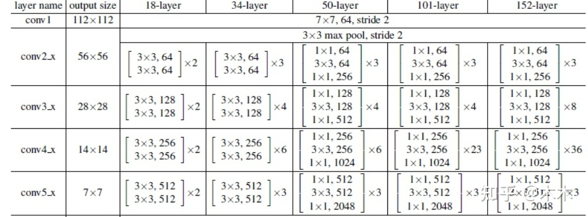
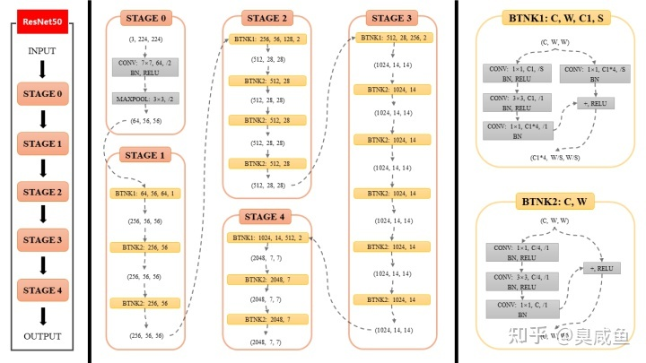
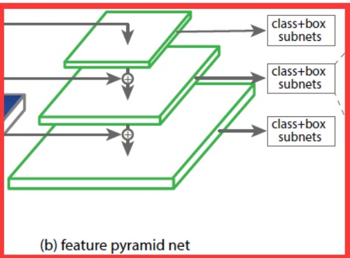
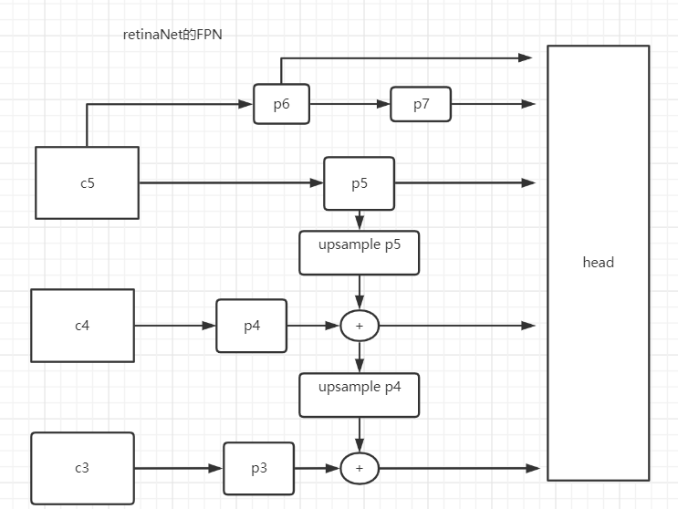

初衷：根据博客学习retinanet以及pytorch的使用。并构建自己的pytorch model习惯

知乎地址：https://zhuanlan.zhihu.com/p/384123384


1 backbone





图片来源[ResNet50网络结构图及结构详解 - 知乎 (zhihu.com)](https://zhuanlan.zhihu.com/p/353235794)

这里注意只有在每个Stage的第一步，ResBlock才会有downsample操作。这里只有stride!=1 或者输出的通道数要是输入的4倍，才是每个stage的第一步。

2 FPN





## anchors解析

[目标检测系列一：RetinaNet之anchor_何以解忧 唯有专注-CSDN博客](https://blog.csdn.net/qq_36251958/article/details/105024133)

## nms

模型在前向时，每个cell会有9个框，因此会产生好多框，需要用置信度和nms过滤。得到最终的带有类别数的anchor结果。

简单来说就是先找到最大的，和其他的做iou运算，如果没有超过我们给的threshold就去除，将最后筛选回来的框的id返回就可以了


## coco data处理

pytorch解析自己的数据集需要继承 `from torch.utils.data import Dataset` 并实现自己的

```
__len__
__getitem__
```

对于coco 可以用 pycocotools来解析。

pytorch 加载数据流程：

```python
创建一个dataset对象
创建一个dataloader对象
循环dataloader对象，将data,label拿到模型中去训练 ==> 
for ii, data in enumerate(data_loader):
	......
```

#### dataset

你需要自己定义一个class，里面至少包含3个函数：
①__init__：传入数据，或者像下面一样直接在函数里加载数据
②__len__：返回这个数据集一共有多少个item
③__getitem__:返回一条训练数据，并将其转换成tensor

#### dataloader

参数：
dataset：传入的数据，即上面的dataset对象。
shuffle = True:是否打乱数据
**collate_fn**：使用这个参数可以自己操作每个batch的数据 。为一个函数，输入为一批数据，输出处理后的数据。

sampler: 其和shuffle是互斥的，一般默认即可。是一个类，继承自from torch.utils.data.sampler import Sampler。 要实现`__init__  __iter__  __len__`

