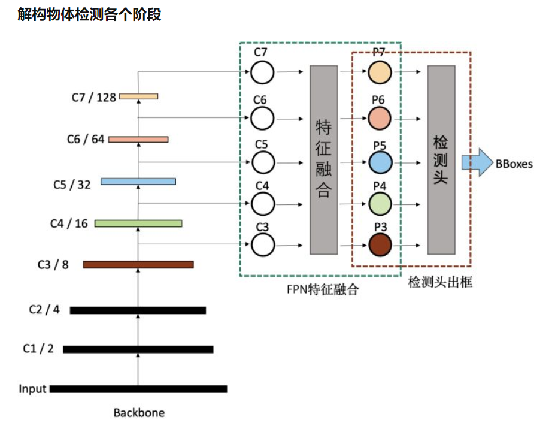

初衷：根据博客学习retinanet以及pytorch的使用。并构建自己的pytorch model习惯

知乎地址：https://zhuanlan.zhihu.com/p/384123384

1 backbone

图片来源[ResNet50网络结构图及结构详解 - 知乎 (zhihu.com)](https://zhuanlan.zhihu.com/p/353235794)

这里注意只有在每个Stage的第一步，ResBlock才会有downsample操作。这里只有stride!=1 或者输出的通道数要是输入的4倍，才是每个stage的第一步。

2 FPN

[目标检测系列一：RetinaNet之anchor_何以解忧 唯有专注-CSDN博客](https://blog.csdn.net/qq_36251958/article/details/105024133)

